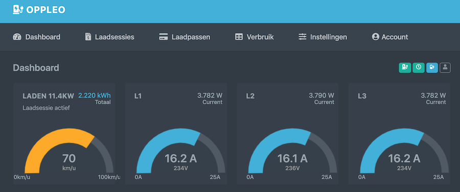

# Oppleo



The Oppleo software package aims to provide additional functionality to extend a basic SmartEVSE based car charger adding RFID tags, a buzzer and LED, an online web front with basic authentication, kWh meter loggin to a database, off-peak charging, and Excel and PDF charge reports.

Combined with some additional components like a relais, cabling and proper connections, a SmartEVSE can be used to charge an electric vehicle from your one or three phase mains. It can do so while balancing the total power consumption. SmartEVSE allows control through a switch, which is used by Oppleo to control access and off peak charging. SmartEVSE also reports charge status through a PWM pin, which is read by Oppleo to provide LED and online charge status.

Oppleo uses modbus interfacing to connect with a kWh meter logging readings to a database. Oppleo can use Prowl to send push messages to the owner.

Oppleo is build using Python3/Flask and runs on a Raspberry Pi (4). You'll need a Raspberry Pi and a SmartEVSE based car charger setup.

## Install Oppleo on a Raspberry Pi 4

### Prereqs

* I run Oppleo on a __Raspberry Pi 4__. I have not tested other versions, I can only assume a 3 would work too. If you need to order one, get a 4, if you have one laying around give it a try.
* You'll need a __SmartEVSE__ to control the actual car charging. Oppleo pulls a pin down to enable/disable charging, so any other EVSE with a similar control pin might work.
* A kWh meter attached through modbus to the Raspberry Pi is not longer required to start and stop charge sessions, however it makes Oppleo much more usefull.
* `ssh` enabled on the Raspberry.
  * Add an empty file named `ssh` (no extension) to the root of the sdcard to enable ssh after boot on the Raspberry. You'll probably need ssh to install Python and Postgres anyway.
* Make sure __apt-get__ is up to date  
  > `sudo apt-get update && sudo apt-get upgrade`
* git installed on your Raspberry
  > `sudo apt-get install git`
* __RFID reader, mult-color LED, Buzzer, and Real-Time Clock__. Technically not needed, but makes for better experience. Make sure they are on the GPIO PINs as per diagram, or change the configuration accordingly.
  * A Raspberry does not come with a Real-Time Clock (RTC). [Read up](https://thepihut.com/blogs/raspberry-pi-tutorials/17209332-adding-a-real-time-clock-to-your-raspberry-pi) to understand if you want one.
    * Install [RasClock](https://afterthoughtsoftware.com/products/rasclock) (Real Time Clock)
    * Check it it is installed using `sudo hwclock -r`
    * Start after boot `sudo nano /boot/config.txt` add
      > `# RasClock RealTime Clock`  
      > `dtoverlay=i2c-rtc,pcf2127`
      * Reboot your Raspberry
      > `sudo reboot`
* __Pyhton3__ and __pip__ installed on the Raspberry
  > `sudo apt-get install python3-dev python3-pip`
* __Postgres__ database installed on your Raspberry
  (Google for [How-to](https://opensource.com/article/17/10/set-postgres-database-your-raspberry-pi)'s)

  * Basic steps involve installing postgresql
    > `sudo apt install postgresql libpq-dev postgresql-client postgresql-client-common -y`
  * Creating a user (no superuser, can be useful to be allowed to create databases, no need to be allowed to create more new roles. Choose your own database username and replace `<dbuser>` (also replace the angle brackets). Make sure you remember the password (`<dbpassword>`).
    > `sudo su postgres`
    > `createuser <dbuser> -P`
  * As user postgres, create a database. Choose your own databasecname and replace `<dbname>`.
    > `createdb <dbname>`
  * As user postgres, start psql, the postgres cmd line tool.
    > `psql`
  * On the psql command line, change the postgres user to allow access to the database.
    > `alter user <dbuser> with encrypted password '<dbpassword>';`
  * Granting privileges on the created database to the created user
    > `grant all privileges on database <dbname> to <dbuser>;`
  * Exit from the psql shell and again from the Postgres user by pressing Ctrl+D twice.

  * You can setup postgres to use Raspbian OS users. This can simplify local postgres usage, but isn't required for Oppleo. I noticed that the default config in `/etc/postgresql/11/main/pg_hba.conf` (the 11 is the version, yours may differ) shows peer as password hast type, referring to the Raspbian user. If you set a non-OS user like I do here, you can either change `peer` to `md5` as default method in the pg_hba.conf file, or simply add `-h localhost` to the psql command line to use md5 configured for network access as done below. Also if you want to allow access to the database from your local 10.0.x.x network you can add a line `host  all   all  10.0.0.0/16  md5` to the pg_hba.conf file.

  * To verify the postgres install, start psql, the postgres cmd line tool, with the username created above. I noticed that the default config in `/etc/postgresql/11/main/pg_hba.conf`.
    > `psql -U <dbuser> -d <dbname> -h <ipaddress>`
  * Create a table
    > `create table people (name text, company text);`
  * Get info on the table using
    > `\d`
    > `\dt people`
  * Drop the table again using
    > `drop table people;`
  * Exit the psql tool using
    > `\q`
  * For the next steps yo need to have an empty database ready, with a user with the proper read-write rights to that database, and know the password. Oppleo will create the tables and required content, not the database itself.

* Install __PIGPIO__ for interfacing with the GPIO (I/O pins) devices. This is required to attache hardware such as the LED, EVSE Switch, Buzzer etc.
  * Install PIGPIO
    > `cd /home/pi`
    > `wget https://github.com/joan2937/pigpio/archive/master.zip`
    > `unzip master.zip`
    > `cd pigpio-master`
    > `make`
    > `sudo make install`
  * The initial part of the make, the compilation of pigpio.c, can take >100 seconds on early model Pis. Be patient. The overall install takes just over 3 minutes.
  * If the Python part of the install fails it may be because you need the setup tools.
    > `sudo apt install python-setuptools python3-setuptools`
  * More details on pigpio install on the [abyz.me.uk](http://abyz.me.uk/rpi/pigpio/) website.
* Install __spidev__ for interfacing with SPI devices. This is required to interface with the RFID reader which uses the SPI bus.
  * Install the C library
    > `cd /home/pi`  
    > `git clone https://github.com/lthiery/SPI-Py.git`
    > `cd SPI-Py`  
    > `sudo python3 setup.py install`
  * Install the pyhton module
    > `sudo pip3 install spidev`  
  * Enable SPI and the PCM at boot.
    * Edit /boot/config.txt
      > `sudo nano /boot/config.txt`
    * Add these lines
      > `dtparam=spi=on`
      > `dtoverlay=spi-bcm2708`
      Make sure to save the file :)
  * Check if properly instaled
    > `lsmod | grep spi`
    * should return something like
      > `spidev                 20480  0`  
      > `spi_bcm2835            20480  0`
* Install mfrc522, the interface module for the RFID reader.
  * Install the PiMyLifeUp.com MFRC522 library.
    > `cd /home/pi`  
    > `git clone https://github.com/pimylifeup/MFRC522-python`  
    > `sudo python3 setup.py install`
  * Install MFRC522 from PiMyLifeUp (same package as listed above)  
    > `sudo pip3 install mfrc522`
  * Make sure to enable SPI on the Pi using `raspi-config`. More details on the [pimylifeup](https://pimylifeup.com/raspberry-pi-rfid-rc522/) page.
* Install RPi.GPIO, a PyPi python module for interfacing with the Raspberry Gneral Purpose IO (GPPIO) pins. This is required to interface with the RTC, LED, the Buzzer, and the SmartEVSE.
  > `cd /home/pi`
  > `sudo pip install RPi.GPIO`
* Install openssl
  > `sudo apt-get install libssl-dev`
* Install mimimalmodbus, used to communicate with the kWh meter
  > `pip3 install -U minimalmodbus`
  * reboot
    > `sudo reboot`
  * and check if the modbus interface is foundShow USB devices. Use `lsusb` to check the USB hub, and `usb-devices` to get a list of USB devices. Use `ls /dev/ttyUSB*` to see the device dev path. Also the command `find /sys/bus/usb/devices/usb*/ -name dev` helps to see the USB devices connected.

  * Install [liquibase](https://docs.liquibase.com/concepts/installation/installation-linux-unix-mac.html). You can follow the guidelines on the liquibase website, below is an example install.
    * Create a directory for liquibase
      > `sudo mkdir /usr/apps/`
      > `sudo mkdir /usr/apps/liquibase`
    * Add the directory to the PATH by running
      > `export PATH=$PATH:/usr/apps/liquibase`
    * Make the updated PATH permanent. Note that this line must be in .bashrc as the install script gets the liquibase path from here.
      > `echo 'export PATH=$PATH:/usr/apps/liquibase' >> ~/.bashrc`

    * Extract the downloaded content to the directory
      > `cd /usr/apps/liquibase`
      > `wget https://github.com/liquibase/liquibase/releases/download/v4.3.1/liquibase-4.3.1.tar.gz`
    * Unpack it
      > `sudo tar -xzf liquibase-4.3.1.tar.gz`
    * Remove the download
      > `sudo rm liquibase-4.3.1.tar.gz`

    * For Liquibase to run correctly, Java must be installed on the raspberry pi. To verify that Java is installed
      > `java -version`
      * If you see the error: -bash: java: command not found, then you need to either install Java, or you need to add the location of the Java executable to your PATH. To install Java on your computer navigate to <https://www.oracle.com/technetwork/java/javase/downloads/jdk8-downloads-2133151.html> and install the Java JDK, and add the location of the Java executable to your PATH.

  * To verify liquibase
    > `cd /hope/pi/oppleo`
    > `liquibase --help`
    The help page should be visible.

  * Create the Oppleo specific `liquibase.properties`
    * Create a local copy of the example liquibase properties:
      > `cp /home/pi/Oppleo/db/liquibase.properties.example /home/pi/Oppleo/db/liquibase.properties`
    * Edit this local copy using any text editor, like `nano` for example
      > `nano /home/pi/Oppleo/db/liquibase.properties`
    * Configure the Oppleo specific liquibase properties in `/home/pi/Oppleo/db/liquibase.properties` using any text editor like `nano` for example
      > `nano /home/pi/Oppleo/db/liquibase.properties`
    * Update the url replacing `<ipaddress>` for the ip or localhost, and `<dbname>` with the database name created earlier. Also update `<dbuser>` and `<dbpassword>` (replace also the angle brackets, they are not part of the syntax).  
      > `url: jdbc:postgresql://<ipaddress>:5432/<dbname>`
      > `username: <dbuser>`
      > `password: <dbpassword>`
    * There is a jdbc file included (postgresql-42.2.14.jar or a newer version). If the included version is not compatible with the installed Postgres either copy the jar from the Postgres install (share/java directory) or download a different version from the [PostgreSQL JDBC Driver](https://jdbc.postgresql.org/) website.

#### Installation

Oppleo is not a nicely packaged resource. Basically you'll pull the developer code and run that. Use ssh to login to the Raspberry. You'' end up in `/home/pi`

* Clone the __Oppleo__ repo in the `/home/pi` folder (note: get the URL from the Clone or Download button above!)
  > `git clone https://github.com/ilseh/Oppleo.git`
* Move into the Oppleo directory
  > `cd Oppleo`
* Create a virtual environment for Oppleo
  > `python3 -m venv venv`
* Activate it
  > `source venv/bin/activate`
* Upgrade pip (if required)
  > `pip install --upgrade pip`
* Install all dependencies from the requirements_raspberry.txt file
  > `pip install -r requirements_raspberry.txt`
* Create an Oppleo ini file
  > `cp /home/pi/Oppleo/src/nl/oppleo/config/oppleo.example.ini /home/pi/Oppleo/src/nl/oppleo/config/oppleo.ini`
* Edit the oppleo.ini file to reflect your local installation. The oppleo.example.ini file has comments to help. Note that the local copied oppleo.ini file is completely overwritten when settings are changed through Oppleos webfront, so remarks etc. will be lost. Make changes using any text editor like `vi` or `nano` when Oppleo is not running.
  * All elements are in the [Oppleo] section. All `True` and `False` are Python, thus capitalizine the first letter is required.
  * `log_file` is the log file location. Default `/tmp/Oppleo.log`
  * `signature` is a random generated signature to identify this application when logging or sending messages through Prowl. No need to manually chnage this.
  * `database_url` is `postgresql://<dbuser>:<dbpassword>@<ipaddress>:5432/<dbname>` where `<dbuser>`, `<dbpassword>`, and `<dbname>` are the values used when installing postgres. `<ipaddress>` can be `localhost` when both postgres and oppleo are installed on the same raspberry pi.  
  * `sqlalchemy_track_modifications` should be `False`
  * `debug` should be `False`. Enabling this shows any uncatched exceptions and errors in the web front. Useful for development or debugging only.
  * The following 5 entries describe the connected hardware, inclusing RFID reader, busser, EVSE and RGB LED. If they are present and connected to the Raspberry Pi through the [GPIO header](https://www.raspberrypi.org/documentation/usage/gpio/) enable them here. After making changes Oppleo needs to restart to take them into effect.
    * `evse_switch` enable if the switch pin of the SmartEVSE is connected. This allows Oppleo to actually prevent or allow charging.
    * `evse_led_reader` enable if the LED pin out of the SmartEVSE is connected to the Raspberry Pi GPIO. Oppleo will detect the EVSE status by detecting the on/off state and pulse-width.
    * `buzzer` enable if a buzzer is connected.
    * `oppleo_led` enable if an RGB led is connected to the GPIO.
    * `mfrc522_rfid_reader` enable if the RFID reader is connected to the SPI bus on the GPIO.
  * `pythonpath` is empty
  * `explain_template_loading` provides a debug information on screen if something goes wrong internally. `False` should be better.
  * The `on_db_failure_` variables come into play if the database cannot be reached by Oppleo. It becomes blind to settings, and thus some fallback settings are required.
    * `on_db_failure_allow_restart` provides a restart button when `True`
    * `on_db_failure_magic_password` is password to enter when making changes on a database failure. Set it through the web front. Looks like `pbkdf2:sha256:<some long string>`
    * `on_db_failure_allow_url_change` allows the database URL to be changed after a failure, could be caused by misconfiguration, through the web front if `True`. Set this to `True` untill it is all working and then set it to `False`, or leave at `True` if security is not an issue.  
    * `on_db_failure_show_current_url` shows the database URL through the web front even if no connection could be made. Shows your database username and password when `True`, so be carefull.

  * Install Oppleo as a service (creates a Oppleo.service file in /etc/systemd/system/ and reloads systemctl)
   > `install/install.sh`

* Note that liquibase will prompt for changes to be registered in Liquibase Hub.

```bash
shell script
Run liquibase update...
Liquibase Community 4.3.1 by Datical
####################################################
##   _     _             _ _                      ##
##  | |   (_)           (_) |                     ##
##  | |    _  __ _ _   _ _| |__   __ _ ___  ___   ##
##  | |   | |/ _` | | | | | '_ \ / _` / __|/ _ \  ##
##  | |___| | (_| | |_| | | |_) | (_| \__ \  __/  ##
##  \_____/_|\__, |\__,_|_|_.__/ \__,_|___/\___|  ##
##              | |                               ##
##              |_|                               ##
##                                                ##
##  Get documentation at docs.liquibase.com       ##
##  Get certified courses at learn.liquibase.com  ##
##  Free schema change activity reports at        ##
##      https://hub.liquibase.com                 ##
##                                                ##
####################################################
Starting Liquibase at 10:06:44 (version 4.3.1 #26 built at 2021-02-12 17:41+0000)
Do you want to see this operation's report in Liquibase Hub, which improves team collaboration?
If so, enter your email. If not, enter [N] to no longer be prompted, or [S] to skip for now, but 
ask again next time (default "S"):
```

If you know you what that go ahead and configure it, otherwise you want to set this to **N** as this install script is used for software updates from the web front, and continuing liquibase interaction here breaks that functionality.

* NOTE: If not running on a Raspberry Pi, detected in the install script by checking `cat /proc/cpuinfo`, the system service file is created but not installed and the service is not enabled and started. If running on another system or VM this can be done manually.
  * Install the Oppleo service file
    > `sudo cp /home/pi/Oppleo/install/Oppleo.service /etc/systemd/system/Oppleo.service`
  * Reload the daemon config...
    > `sudo systemctl daemon-reload`
  * Start the service
    > `sudo systemctl start Oppleo.service`
  * Check the status
    > `sudo systemctl status Oppleo.service`
  * Enable the service (restart after boot)
    > `sudo systemctl enable Oppleo.service`

---

## Oppleo should now be running

Check <http://localhost/> or the IP address of the raspberry. To login create a user (description below).

---

### After install

* What to do once Oppleo is running:
  * First create a default admin user and change the default password.
    * Creating the admin user can be done directly in the database (2) or from the Raspbian command line through the `createuser.py` utility (1).
      1. You can use the `createuser.py` utility. This command line utility is interactive and can remove all existing users from the database and create users with Administrative rights (only role Oppleo supports).
        Go to the Oppleo directory
          > `cd /home/pi/Oppleo`
        Run the utility
          > `python3 src/createuser.py`
      2. Directly into the database
        Start a postgress command line
          > `psql -U <dbuser> -d <dbname> -h <ipaddress>`
        Enter the user into the `users` table. You can change the username if desired.
          > `insert into users (username, password, authenticated) values ('admin', 'pbkdf2:sha256:150000$mclLAqwB$2e8744c20410984c9a448b4bb2ceb9b8f0d913cfce9dcee24e775f138b91ab54', false);`
          This is the hash for the default `admin` password. You can create a the hash for any password using the `python3 src/createpw.py` utility.

  * go to settings in the webfront and change them. Not all settings are changeable in the web front, for some you'll have to update the database. Tables:
    * `charger_config` for general configurations
    * `energy_device` for the modbus settings
    * `off_peak_hours` for the recurring weekdays, the holidays can be changed through the webfront
  * The default username/password is admin/admin. Through the web front only the password can be changed. There are no other users implemented, however adding users manually to the database should work. There are no roles other than Unauthenticated and Admin.
  * You can restart Oppleo through the webapp. You can also restart or shutdown the Raspberry Pi itself. Use this when powering the Pi off, as poweer interruption can cause data corruption. I have been looking into a UPS for the Pi, as earlier versions shewed my sdcards on reboot more than once. The Pi 4 however has been nice to the sdcard on power cycles, I have yet to have corruptions on it. Also boot from USB is an option.
  * There are test scripts in `Oppleo/test`, to validate the RFID reader, the LEDs, the Modbus kWh meter readout, the Buzzer, the SmartEVSE control (enable/disable) and reading the PWM led output of the SmartEVSE. Use these to validate your diagram.
  * Oppleo logs to `/tmp/Oppleo.log`

---

## Restoring a backup

Oppleo has backup functionality. Each backup contains 5 items:

1. a dump of the database,
2. a copy of the ini config file,
3. a copy of the liquibase.properties file,
4. a copy of the Oppleo.service file, and
5. a zipped fiel containing the update log files.

### Unzip the backup file into its onw directory

  > `unzip -d restore backup_2021-03-23_05.00.01_laadpaal_noord.zip`

### Database restore

#### Find database_url from the oppleo.ini config file to use in the restore command

  > `cat src/nl/oppleo/config/oppleo.ini | grep database_url | cut -d'=' -f2`
should return something in the format `postgresql://<user>:<password>@<ipaddress>:5432/<database>`

#### Restore database

1. Provide a clean database to restore into, to prevent existing row id problems
    > `psql -U <user> -h <ip address> -d <dbname>`
    >
    ```bash
    drop table charge_session ;
    drop table charger_config ;
    drop table databasechangelog ;
    drop table databasechangeloglock ;
    drop table energy_device_measures ;
    drop table energy_device ;
    drop table off_peak_hours ;
    drop table rfid ;
    drop table users ;
    ```

#### 2. Restore the dump into the database

The database backup is the pg_dump file. Use --no-owner option to stop pg_restore trying to set the ownership of the objects to the original owner. Specify the user by --role
  > `pg_restore -d '<database_url>' --no-owner --role=<user> -Fc postgres_YYYY-MM-DD_HH.mm.ss.pg_dump`

#### 3. Update the charger name (if desired)

Again use the postgress command line
  > `psql -U <user> -h <ip address> -d <dbname>`

#### 3a. create a new charger name entry in the database

  >
  ```sql
  INSERT INTO energy_device( 
      energy_device_id, port_name, slave_address, baudrate, bytesize, parity,
      stopbits, serial_timeout, debug, mode, close_port_after_each_call,
      modbus_timeout, modbus_config, device_enabled 
  )
  SELECT 'laadpaal_macos', port_name, slave_address, baudrate, bytesize, parity,
      stopbits, serial_timeout, debug, mode, close_port_after_each_call,
      modbus_timeout, modbus_config, device_enabled 
  FROM energy_device WHERE energy_device_id='laadpaal_noord';
  ```

#### 3b. update all entries to the new chargername
  >
  ```sql
  UPDATE charger_config SET charger_name = '<new name>';
  UPDATE charge_session SET energy_device_id = '<new name>';
  UPDATE energy_device SET energy_device_id = '<new name>';
  UPDATE energy_device_measures SET energy_device_id = '<new name>';
  ```

#### 3c. delete the old charger name

  > `DELETE FROM energy_device WHERE energy_device_id = '<old name>';`

#### 4. Update the admin user (if required)

  > `python3 src/createuser.py`

### Restore Oppleo ini file

  > `cp oppleo_YYYY-MM-DD_HH.mm.ss.ini src/nl/oppleo/config/oppleo.ini`

### Restore liquibase properties

  > `cp liquibase_YYYY-MM-DD_HH.mm.ss.properties db/liquibase.properties`

### Restore Oppleo.service file

* This is mostly for reference to a working situation. Create a new Oppleo.service file using the `install/install.sh` script.

---

### BOM

Oppleo works with

* [Raspberry Pi 4 Model B - 2GB](https://www.kiwi-electronics.nl/raspberry-pi/raspberry-pi-4/raspberry-pi-4-model-b-2gb)
* [SmartEVSE](https://www.stegen.com/nl/ev-producten/66-smart-evse-controller.html)
* [SDM630 Modbus 3-phase 100A MID kWh meter](https://www.sandervunderink.nl/kwh-meter-3-fase-100a-mid-keur-sdm630-modbus.html)
* [Joy-it SBC-RS485](https://www.reichelt.nl/raspberry-pi-usb-rs485-interface-rs485-ch340c-rpi-usb-rs485-p242783.html)
* [Joy-it RFID-module, NXP MFRC-522](https://www.reichelt.nl/ontwikkelingsbord-rfid-module-nxp-mfrc-522-debo-rfid-rc522-p192147.html)
* [Joy-it KY-016 RGB- 5 mm-LED](https://www.conrad.nl/p/joy-it-rgb-5-mm-led-167-miljoen-kleuren-1656370)
* [Joy-it COM-KY012APB active piëzo-buzzermodule](https://www.conrad.nl/p/joy-it-actieve-piezo-buzzermodule-1695383)
* [RasClock - Raspberry Pi Real Time Clock Module](https://www.kiwi-electronics.nl/RasClock-Raspberry-Pi-Real-Time-Clock-Module) with [CR1220 battery [GP-CR1220]](https://www.kiwi-electronics.nl/cr1220-batterij)

---

### Some Developer specific references

>
```bash
sudo apt-get install libpq-dev
sudo apt install python3.6-dev
sudo apt-get install build-essential
```

### gcc errors installing requirements_non_raspberry.txt on MacOS

If there are gcc errors when installing the non-raspberry dependencies on MacOS, add
  > `export LDFLAGS="-L/usr/local/opt/openssl/lib"`
before running
  > `pip install -r requirements_non_raspberry.txt`

### wget on macos

Install wget through brew `brew install wget`

### postgres on macos

Install using `brew install postgresql` (more info [here](https://www.codementor.io/@engineerapart/getting-started-with-postgresql-on-mac-osx-are8jcopb) and [here](
https://www.postgresql.org/files/documentation/pdf/12/postgresql-12-A4.pdf)).
Start server using
  > `pg_ctl -D /usr/local/var/postgres start`
Stop using
  > `pg_ctl -D /usr/local/var/postgres stop`
Start automatically and have launchd start postgresql now and restart at login
  > `brew services start postgresql`
If `psql -U postgres` returns `psql: error: could not connect to server: FATAL:  role "postgres" does not exist` create the postgres user. This can occur when installed through homebrew.
  > `/usr/local/opt/postgres/bin/createuser -s postgres`
You can use [Postgres.app](https://postgresapp.com/)
Create the database using
  > `/usr/local/opt/postgres/bin/createdb <dbname>`
To delete or drop a database use
  > `/usr/local/opt/postgres/bin/dropdb <dbname>`
The `pg_hba.conf` file to configure access over network to the postgres database is located in `/usr/local/var/postgres/pg_hba.conf`. Possibly the method should be updated from trust to md5.

### threads

The greenlets or eventlets are light threads withing a thread. There is no real concurrency.

### pkg-resources==0.0.0

Running `pip freeze > requirements_raspberry.txt` can add a line `pkg-resources==0.0.0` which in term can cause errors installing the dependencies. This line can be removed from the requirements files.
  > `pip freeze | grep -v "pkg-resources" > requirements_raspberry.txt"`
excludes pkg-resources from the file when generating it.

### GPIO

The raspberry GPIO has internal pull-up and pull-down resistors. They need to be enabled though if required. The EVSE status led is pulled up by the GPIO to allow proper high voltages on the pin. The EVSE only pulls it down when switching.
  `GPIO.setup(port_or_pin, GPIO.IN, pull_up_down=GPIO.PUD_DOWN)`
[More info](https://raspi.tv/2013/rpi-gpio-basics-6-using-inputs-and-outputs-together-with-rpi-gpio-pull-ups-and-pull-downs)
More GPIO info on the RPi.GPIO Python Module on [pypi.org](https://pypi.org/project/RPi.GPIO/) and on [SourceForge](https://sourceforge.net/p/raspberry-gpio-python/wiki/Home/).

### PWM

PWM read using pigpio
[examples](http://abyz.me.uk/rpi/pigpio/examples.html)

## Raspberry revision

To check what revision pi you have use `cat /proc/cpuinfo` or in Pyhton `GPIO.RPI_REVISION`. 0 = Compute Module, 1 = Rev 1, 2 = Rev 2, 3 = Model B+/A+
import RPi.GPIO as GPIO loads the RPi.GPIO library so we can use it
GPIO.VERSION this returns the version number of RPi.GPIO
[raspi.tv](https://raspi.tv/2013/rpi-gpio-basics-1-how-to-check-what-rpi-gpio-version-you-have)
[raspi.tv](https://raspi.tv/2013/rpi-gpio-basics-2-how-to-check-what-pi-board-revision-you-have)
